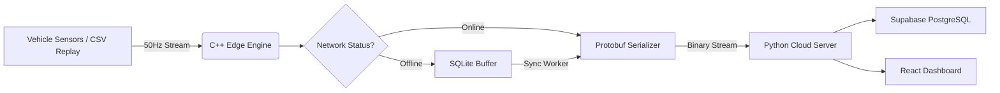

# Fault-Tolerant Tesla Telemetry Logger

> **Status:** Production-ready with multi-vehicle fleet support

A high-performance C++ telemetry engine designed to capture, buffer, and synchronize vehicle data from multiple Tesla vehicles during intermittent network connectivity. Unlike standard cloud-based loggers that lose data in tunnels or rural dead zones, this logger utilizes a **Store-and-Forward** architecture to ensure 100% data continuity.

## The Problem
Standard vehicle telemetry loggers (e.g., TeslaFi, Tessie) rely on continuous API polling. If the vehicle drives into a "dead zone" (parking garage, tunnel, remote highway), the connection is severed, and telemetry data for that period is lost forever.

## The Solution
This logger runs as an embedded service on the edge (simulated on Linux). It implements a fault-tolerant state machine:
1.  **Ingestion:** Reads high-frequency CAN-bus signals (50Hz) via a replay harness.
2.  **Buffering:** If the network is detected as "Offline," data is serialized via **Protocol Buffers** and written atomically to a local **SQLite** database.
3.  **Recovery:** A background worker thread detects network restoration and prioritizes uploading the oldest buffered records first, preserving the timeline integrity.
4.  **Multi-Vehicle:** Supports concurrent telemetry streams from multiple vehicles with VIN-based routing.

## Architecture


## Tech Stack
* **Edge Logic:** C++17
* **Serialization:** Protocol Buffers (Google Protobuf)
* **Persistence:** SQLite (WAL mode for concurrent writes)
* **Backend:** Python (FastAPI with WebSocket support)
* **Database:** Supabase PostgreSQL (free tier, multi-vehicle support)
* **Frontend:** React 18 + TypeScript (Real-time dashboard with Recharts)
* **Infrastructure:** Terraform + Google Cloud Run (serverless deployment)
* **Simulation:** Hardware-in-the-loop replay using real Tesla Model 3 drive logs.

## Features

### 🚗 Multi-Vehicle Fleet Support (NEW)
- **5-Vehicle Simulation**: Concurrent telemetry from Model 3, Model Y, Model S Plaid, and Model X
- **VIN-Based Routing**: Each vehicle identified by VIN, stored separately in database
- **Independent State**: Per-vehicle compression predictors and offline buffers
- **Varied Data**: Realistic variations in speed, power, battery, and heading per vehicle type
- **Fleet Orchestration**: Run entire fleet with single command (`./run_fleet.sh`)

### Smart Compression Engine
- **Predictive Compression**: Exponential smoothing algorithm predicts next telemetry values
- **Selective Transmission**: Only sends fields when `|actual - predicted| > threshold`
- **Bandwidth Savings**: 60-90% reduction on highways, 20-40% in city driving
- **Automatic Resync**: Force-sends all fields every 30 seconds to prevent drift
- **Seamless Reconstruction**: Server maintains synchronized predictor state to reconstruct missing fields
- **Compression Thresholds**:
  - Speed: ±2 mph
  - Power: ±5 kW
  - Battery: ±0.5%
  - Heading: ±5°

### Fault-Tolerant Store-and-Forward
- **Offline Buffering**: SQLite-backed storage automatically captures data during network outages
- **Smart Flush Logic**: Uploads buffered records with 100ms spacing to prevent time-delta calculation errors
- **Predictor Synchronization**: Maintains predictor state across offline/online transitions
- **Full Data Storage**: Buffered records store all fields (no compression) for accurate reconstruction
- **Zero Data Loss**: 100% data continuity even in tunnels, parking garages, or rural dead zones

### Real-Time Dashboard
- **Interactive Terminal**: Built-in logger control with play/stop button - no need to run scripts separately
- **Live Telemetry Charts**: Speed, distance traveled, power usage, and efficiency visualization
- **WebSocket Streaming**: Real-time data updates from the server
- **Press Enter**: Quick disconnect from the terminal view
- **Responsive Grid Layout**: Desktop and mobile-friendly interface

### Production-Ready Infrastructure
- **Google Cloud Run**: Auto-scaling serverless deployment
- **Docker Multi-Stage Builds**: Optimized container images with compiled C++ binaries
- **Protocol Buffers**: Efficient binary serialization (60% smaller than JSON)
- **Health Monitoring**: `/status` endpoint with compression stats and system metrics
- **Graceful Shutdown**: SIGINT/SIGTERM handlers ensure clean database closure

## How Compression Works

The compression system uses **exponential smoothing** to predict telemetry values:

```
predicted_value = 0.3 × actual_current + 0.7 × predicted_previous
```

**Decision Logic:**
1. Client predictor calculates expected next values based on historical trends
2. Compare actual sensor reading to prediction
3. If difference exceeds threshold → transmit field
4. If within threshold → omit field (save bandwidth)
5. Server predictor reconstructs omitted fields using its synchronized state

**Example Highway Scenario:**
- Steady 65 mph cruise control
- Speed prediction: 65.1 mph (very close!)
- Actual: 65.0 mph → difference 0.1 mph < 2 mph threshold
- Result: `vehicle_speed` field omitted from protobuf → **~30% packet size reduction**

**Resync Safety:**
- Every 30 seconds: transmit all fields regardless of thresholds
- Prevents predictor drift from accumulating errors
- Ensures long-term accuracy

## Future Work

### Scalability & Orchestration
- **Apache Kafka**: Event streaming architecture for multi-vehicle ingestion
  - Topic partitioning by VIN (Vehicle Identification Number)
  - Consumer groups for parallel processing
  - Kafka Streams for real-time analytics
- **Kubernetes Deployment**: 
  - Horizontal pod autoscaling for logger fleet management
  - StatefulSets for SQLite buffer persistence
  - Helm charts for configuration management