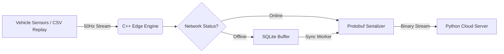

# Fault-Tolerant Tesla Telemetry Logger

> **Status:** In Development (Prototype Phase)

A high-performance C++ telemetry engine designed to capture, buffer, and synchronize vehicle data (Tesla Model 3) during intermittent network connectivity. Unlike standard cloud-based loggers that lose data in tunnels or rural dead zones, this logger utilizes a **Store-and-Forward** architecture to ensure 100% data continuity.

## The Problem
Standard vehicle telemetry loggers (e.g., TeslaFi, Tessie) rely on continuous API polling. If the vehicle drives into a "dead zone" (parking garage, tunnel, remote highway), the connection is severed, and telemetry data for that period is lost forever.

## The Solution
This logger runs as an embedded service on the edge (simulated on Linux). It implements a fault-tolerant state machine:
1.  **Ingestion:** Reads high-frequency CAN-bus signals (50Hz) via a replay harness.
2.  **Buffering:** If the network is detected as "Offline," data is serialized via **Protocol Buffers** and written atomically to a local **SQLite** database.
3.  **Recovery:** A background worker thread detects network restoration and prioritizes uploading the oldest buffered records first, preserving the timeline integrity.

## Architecture

## Tech Stack
* **Edge Logic:** C++17 (Thread-safe ring buffer, fstreams)
* **Serialization:** Protocol Buffers (Google Protobuf)
* **Persistence:** SQLite (WAL mode for concurrent writes)
* **Backend:** Python (FastAPI)
* **Simulation:** Hardware-in-the-loop replay using real Tesla Model 3 drive logs.
